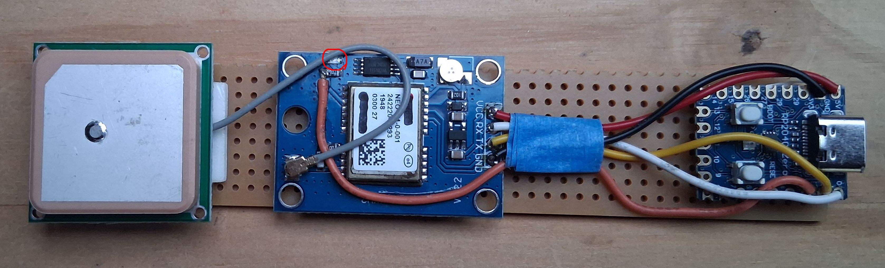

# Guide Matériel & Assemblage

Ce guide détaille les composants nécessaires et les étapes d'assemblage pour construire votre récepteur GPS Stratum 0.

## 1. Approvisionnement des Composants

Le projet est conçu pour être accessible et peu coûteux. Voici la liste des composants recommandés :

| Composant | Modèle Recommandé | Rôle |
| :--- | :--- | :--- |
| **Microcontrôleur** | **Waveshare RP2040-Zero** | Interface USB et traitement du signal. Choisi pour sa taille compacte et sa compatibilité Arduino. |
| **Module GPS** | **u-blox NEO-6M** ou **NEO-8M** | Réception satellite. Souvent vendu sous la référence `GY-GPS6MV2` ou `GY-NEO6MV2`. |
| **Câble USB** | USB Type-C (Data) | Liaison vers le PC. Assurez-vous qu'il transmet bien les données (pas seulement la charge). |

## 2. Câblage Inter-modules

Le montage relie le module GPS au microcontrôleur via une liaison série (UART).

### Schéma de connexion

| Pin GPS | Pin RP2040-Zero | Description |
| :--- | :--- | :--- |
| **VCC** | **5V** (ou VBUS) | Alimentation du module GPS. |
| **GND** | **GND** | Masse commune (Référence électrique). |
| **TX** | **GP1** (RX) | Transmission des données NMEA du GPS vers le RP2040. |
| **RX** | **GP0** (TX) | Réception des commandes de configuration (Optionnel). |

> **⚠️ Important :** Le câblage série est croisé. Le **TX** (Transmit) du GPS doit aller sur le **RX** (Receive) du microcontrôleur.

## 3. Câblage du Signal PPS

C'est la connexion la plus critique pour la précision temporelle de ce projet.

*   **Source :** Pin **PPS** du module GPS. (fil orange sur la photo)
*   **Destination :** Pin **GP2** du RP2040-Zero.

**Pourquoi est-ce indispensable ?**
Les données NMEA (envoyées via TX/RX) fournissent la date et l'heure, mais avec une latence variable (Jitter) de plusieurs centaines de millisecondes due au traitement série.
Le signal **PPS (Pulse Per Second)** est une impulsion électrique envoyée physiquement au début exact de chaque seconde atomique. Le RP2040 utilise ce signal pour aligner l'envoi des données au PC avec une précision microseconde.

### Indicateur Visuel (LED PPS)
La plupart des modules GPS (u-blox NEO-6M/8M) possèdent une petite LED intégrée reliée au signal PPS.
*   **Comportement :** Elle reste éteinte (ou fixe selon le modèle) tant que le GPS cherche les satellites. Elle se met à clignoter dès que le "Fix" est acquis (3D Fix).
*   **Caractéristiques du signal :** C'est le front montant (le début de l'allumage) qui marque la seconde précise.
> **Note :** L'impulsion électrique dure exactement 100 ms.

## 4. Positionnement et Perturbations

Les signaux GNSS sont des ondes radio extrêmement faibles (-125 dBm à -160 dBm). L'environnement physique du montage impacte directement la qualité de réception (SNR).

### Éviter les interférences (EMI)
L'électronique numérique rapide (le processeur du RP2040, le port USB, le PC) génère du "bruit" radiofréquence qui peut brouiller l'antenne GPS.
*   **Distance :** Ne collez pas l'antenne GPS directement sur le RP2040. Laissez au moins 5 à 10 cm de câble entre les deux.
*   **Boîtier :** Si vous utilisez un boîtier métallique, l'antenne doit impérativement être à l'extérieur.

### Orientation de l'antenne
*   L'antenne céramique (le carré plat) doit avoir une **vue dégagée vers le ciel**.
*   Elle fonctionne à travers le plastique, le verre ou le bois, mais pas à travers le métal ou la fibre de carbone.
*   Pour une utilisation en intérieur (proche d'une fenêtre), la précision sera moindre (Stratum 1 dégradé) par rapport à une antenne extérieure active.

## 5. Installation du Firmware (Stratum 0)

Une fois le matériel assemblé, vous devez flasher le RP2040 pour qu'il agisse comme une interface intelligente.

### Méthode A : Fichier prêt à l'emploi (Recommandé)

1.  Téléchargez le fichier `.uf2` depuis la section **Releases** du projet GitHub.
2.  Débranchez le RP2040 du PC.
3.  Maintenez le bouton **BOOT** du RP2040 enfoncé et branchez-le au PC.
4.  Un disque `RPI-RP2` apparaît dans l'explorateur de fichiers.
5.  Copiez le fichier `.uf2` dans ce disque.
6.  Le RP2040 redémarre automatiquement : votre matériel est prêt.

### Méthode B : Compilation avec Arduino IDE (Avancé)

Si vous souhaitez modifier le code ou compiler vous-même, voici la procédure détaillée.

#### 1. Prérequis Logiciels
*   Installez l'**Arduino IDE** (v2.x).
*   Ajoutez l'URL suivante dans **Fichier > Préférences > URL de gestionnaire de cartes supplémentaires** :
    `https://github.com/earlephilhower/arduino-pico/releases/download/global/package_rp2040_index.json`
*   Dans **Outils > Carte > Gestionnaire de cartes**, installez le core **"Raspberry Pi Pico/RP2040"** (par Earle F. Philhower).

#### 2. Configuration de l'IDE
Dans le menu **Outils**, sélectionnez :
*   **Carte :** Waveshare RP2040-Zero
*   **USB Stack :** **Adafruit TinyUSB** (⚠️ Indispensable : ne pas installer la librairie manuellement, utiliser celle du Core).
*   **CPU Speed :** 133 MHz

#### 3. Téléversement
1.  Ouvrez le code source (`.ino`) disponible dans le dépôt.
2.  Branchez le RP2040 en maintenant le bouton **BOOT** enfoncé.
3.  Cliquez sur **Téléverser** dans l'IDE.

## 6. Fonctionnement du Firmware (Pour aller plus loin)

Le code du RP2040 ne se contente pas de relayer les données. Il transforme le module GPS grand public en une horloge de référence scientifique.

### Le défi technique
Un module GPS émet deux informations :
1.  Le signal **PPS** : Une impulsion électrique ultra-précise au début de la seconde.
2.  La trame **NMEA** : Un message texte ("Il est 12h00m00s") envoyé via le port série.

Le problème est que le message texte arrive **après** l'impulsion (environ 100 à 500ms plus tard). Si l'ordinateur attend le message pour se caler sur le *prochain* PPS, il sera en retard d'une seconde.

### La solution logicielle
Le firmware utilise un algorithme de "Time Adder" :
1.  Il lit la trame NMEA dès qu'elle arrive.
2.  Il **ajoute 1 seconde** à l'heure reçue (gestion des changements de minute, heure, jour, année incluse).
3.  Il stocke cette trame "futuriste" en mémoire.
4.  Il attend le prochain signal PPS.
5.  Dès que le PPS claque, il envoie immédiatement la trame modifiée via USB.

Résultat : Windows reçoit l'heure "12:00:01" à la microseconde exacte où la seconde 12:00:01 commence.
